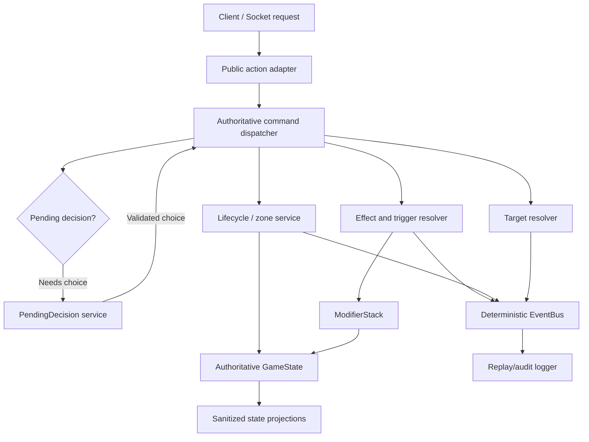

# Phase 2 Plan — Authoritative Rules-State Engine

## 1. Purpose and placement in the resurrection

Phase 2 turns the current partial `GameState` into the **single authoritative, deterministic rules model** for a match.

Phase 0 established validated card data and the compiled DSL contract. Phase 1 established deterministic event dispatch, modifier provenance, and causal logging. Phase 2 must connect those foundations to a coherent game-state domain that can safely represent every current rule and support exceptional future card mechanics without baking card-specific logic into `GameState`.

### Phase boundaries

| Phase       | Responsibility                                                                                                                                     |
| ----------- | -------------------------------------------------------------------------------------------------------------------------------------------------- |
| **Phase 0** | Validated YAML source, compiled immutable card definitions, source-data contracts                                                                  |
| **Phase 1** | Deterministic event infrastructure, state modifier provenance, logging                                                                             |
| **Phase 2** | Authoritative game state, zones, lifecycle, rules primitives, transforms, built-in rules, typed trigger/requirement contracts, Anima and Hwayeomsa |
| **Phase 3** | Complete player-facing action catalogue and action UX/protocol built on Phase 2 commands                                                           |
| **Phase 4** | Broad custom-card effect coverage and the remaining attribute mechanics                                                                            |
| **Phase 5** | Full cross-system/regression coverage                                                                                                              |
| **Phase 6** | Socket/UI protocol and rendering on the stable state contract                                                                                      |

Phase 2 will necessarily provide internal commands for lifecycle operations—draw, deploy, summon, attach, detach, transform, destroy, move, create, reclaim, choose targets. Phase 3 will expose and compose those primitives into the full public action set rather than duplicating business rules.

---

## 2. Confirmed design decisions

The implementation plan is based on the decisions provided during planning:

1. **RULES.md remains authoritative.**
2. **No runtime parsing of `raw` card text.**
   - The compiler will parse canonical source trigger and requirement text into a typed, versioned AST.
   - Runtime receives structured data only.
   - Unsupported canonical trigger/requirement patterns must fail compilation with actionable diagnostics; they must not silently become runtime `custom` effects.
3. **Player choices use an authoritative pending-decision state.**
   - Effects can pause and create a typed decision instead of trusting arbitrary client-supplied targets.
4. **Evolution and ignition are mandatory and immediate.**
5. **Transformation preserves damage taken**, rather than preserving literal current HP.
6. **Evolution preserves legal attached equipment, conditions, granted abilities, combat-slot state, and other non-native modifiers.**
   - Old native traits/passives are removed and replaced atomically by the transformed definition’s native traits/passives.
7. **Multiple source evolution lines are OR alternatives.**
   - Karaka evolves when its currently selected position matches the corresponding equipment alternative.
8. **Equipment reverts to its base, non-ignited definition when it returns to hand** after detachment or bearer death.
9. **Reclaim uses a pending owner choice** among legal discard candidates.
10. **All built-in traits and conditions in RULES.md are Phase 2 scope.**
11. **Fire Core and Incinerate I–IV are ordinary unreachable YAML cards**, not opaque system cards.
12. **Fire Charges are player-scoped and persist between rounds.**
13. **Fire Core is created only when it is not already in that player’s hand.**
14. **Fire Core consumes the highest affordable Incinerate tier automatically.**
15. **Fire Core and Incinerate cards go to discard after normal skill resolution.**

---

## 3. Existing-state audit: required corrections

The Phase 2 rewrite must correct the following rather than layering over them.

| Current issue                                                                  | Required Phase 2 correction                                                                                                                                  |
| ------------------------------------------------------------------------------ | ------------------------------------------------------------------------------------------------------------------------------------------------------------ |
| PascalCase legacy events such as `OnRoundStart` coexist with namespaced events | Adopt one canonical namespaced event catalog; remove gameplay use of legacy names in the same migration                                                      |
| `GameState` mutates zones/resources directly in several paths                  | Route all authoritative mutations through domain services and lifecycle events                                                                               |
| `Card` instance IDs and game setup use `Math.random()`                         | Use game-scoped deterministic ID allocation and injected seeded RNG                                                                                          |
| No `discard` zone                                                              | Add it and enforce every card’s location                                                                                                                     |
| Units remain in `field` after death                                            | Destroyed units leave the field, detach equipment, clean source/target modifiers, unregister subscriptions, and move their original card instance to discard |
| No equipment attachment model                                                  | Add attachment instances, bearer relationship, form state, legal attachment validation, displacement, return-to-hand behavior, and ignition                  |
| `combatSlotCodes` is only metadata                                             | Replace with slot-group state: available/spent, including the dynamic Anima Shinheuh slot                                                                    |
| Native traits exist only as display metadata                                   | Install native traits into `ModifierStack` through a source lease on deployment                                                                              |
| Conditions never expire                                                        | Expire condition modifiers during canonical round-end resolution                                                                                             |
| Barrier-use state is not reset                                                 | Replace `_barrierUsedThisRound` with a round-scoped usage ledger reset at round start                                                                        |
| No deck legality or normal-draw restrictions                                   | Validate 30-card deck rules, duplicate policy, `unreachable`, transformed forms, Shinheuh, and other deck constraints                                        |
| Empty deck draws silently stop                                                 | Resolve immediate game loss on an attempted draw from an empty deck                                                                                          |
| No game-over state                                                             | Add terminal match status and reject all subsequent non-system transitions                                                                                   |
| `_findUnit()` scans the whole board                                            | Maintain authoritative indexes by unit/card/attachment IDs                                                                                                   |
| `Logger` snapshots omit relevant state                                         | Snapshot zones, modifiers, slots, pending decisions, transforms, game status, RNG/sequence metadata, and relevant public/private projections                 |
| Logger limits causation to three depths                                        | Make the causation tree recursively complete, with a configurable storage/serialization safety limit rather than silent truncation                           |
| Modifier IDs are module-global                                                 | Make modifier and instance IDs game-scoped and deterministic                                                                                                 |
| `ModifierStack.getEffective()` has order-sensitive set/override behavior       | Define and enforce a deterministic modifier precedence model                                                                                                 |

---

# 4. Target architecture



## 4.1 Architectural principles

### Immutable definitions, mutable instances

- cards.json remains immutable compiled data.
- A card definition is never mutated by gameplay.
- Every card in deck, hand, discard, field, or attachment ownership is a **card instance** with a deterministic game-local ID.
- A deployed unit is a **unit instance** referencing a card instance and active definition.
- An equipment attachment is an explicit **attachment instance**, rather than an implicit property attached to a unit.
- Transformations change the active definition of the relevant unit/equipment instance while preserving its game identity and allowed state.

### One authoritative mutation path

No action, handler, `Unit`, or `Card` object may directly perform a hidden `field.push`, `hand.splice`, resource decrement, HP mutation, or attachment mutation.

Instead, named state/lifecycle services own operations such as:

- `moveCard`
- `drawCard`
- `createCard`
- `discardCard`
- `deployUnit`
- `summonUnit`
- `destroyUnit`
- `attachEquipment`
- `detachEquipment`
- `transformUnit`
- `transformEquipment`
- `spendCombatSlot`
- `changeShinsu`
- `changeLighthouses`
- `applyDamage`
- `resolveLoss`

Every operation validates its invariants before it commits state and emits canonical events.

### Typed ASTs, never raw runtime parsing

`raw` remains preserved for display, audit, diagnostics, and source traceability. It is not executable.

The compiler must introduce typed structures for:

- triggers,
- requirements,
- targeting selectors,
- effect nesting/composition,
- card creation references,
- positional predicates,
- source/ownership predicates,
- transformation alternatives.

Example shape:

```js
{
  type: "event_trigger",
  event: "equipment:attached",
  subject: "self",
  alternatives: [
    {
      all: [
        { type: "unit_position_is", position: "fisherman" },
        { type: "equipment_name_is", name: "Karaka's Armor Suit" }
      ]
    }
  ],
  raw: "Fisherman: equip with Karaka's Armor Suit"
}
```

The exact AST format must be documented and schema-validated. It should be deliberately extensible through `all`, `any`, `not`, selectors, predicates, and typed effect references.

---

# 5. Implementation plan

## Task 1 — Establish Phase 2 contracts before implementation

### 1.1 Define canonical domain vocabulary

Create a central rules/domain vocabulary for:

- zones,
- card instance states,
- game terminal statuses,
- event names,
- decision types,
- source categories,
- modifier types and operations,
- target selector types,
- card lifecycle transitions,
- transform states,
- combat-slot groups,
- deterministic ID prefixes.

Example source identity conventions:

| Entity               | Example                       |
| -------------------- | ----------------------------- |
| Card instance        | `card:42`                     |
| Unit instance        | `unit:42`                     |
| Equipment attachment | `attachment:17`               |
| Native unit source   | `native:unit:42`              |
| Passive source       | `passive:unit:42:0`           |
| Ability source       | `ability:unit:42:1`           |
| Equipment source     | `equipment:attachment:17`     |
| Attribute source     | `attribute:unit:42:hwayeomsa` |
| System source        | `system:round:5`              |
| Decision             | `decision:8`                  |

### 1.2 Create the canonical event catalog

Migrate all engine use to namespaced event names. Representative groups:

- `game:created`
- `game:started`
- `game:round:start`
- `game:round:end`
- `game:turn:start`
- `game:turn:end`
- `game:ended`
- `card:created`
- `card:draw:attempt`
- `card:drawn`
- `card:moved`
- `card:discarded`
- `unit:deploy`
- `unit:summon`
- `unit:destroyed`
- `unit:position:changed`
- `unit:damage:intent`
- `unit:damage:applied`
- `unit:healed`
- `equipment:attach`
- `equipment:attached`
- `equipment:detach`
- `equipment:detached`
- `unit:evolution:triggered`
- `unit:evolved`
- `equipment:ignition:triggered`
- `equipment:ignited`
- `state:combat-slot:changed`
- `state:shinsu:changed`
- `state:lighthouse:changed`
- `decision:created`
- `decision:resolved`
- `decision:cancelled`

### Acceptance criteria

- No runtime gameplay code emits or subscribes to `On*` events.
- The catalog documents producer, payload contract, phase expectations, cancellation semantics, and child-event behavior.
- Event payloads include a consistent event correlation/causation identity and human-readable message metadata where useful.
- Every domain transition emits exactly one canonical lifecycle event sequence.
- Existing Phase 1 DFS ordering and error isolation are preserved and covered by regression tests.

---

## Task 2 — Replace the state model with authoritative zones and indexes

### 2.1 Define player and match state

Each player must own:

- deck,
- hand,
- discard pile,
- battlefield lines,
- attachment inventory/index,
- lighthouse count,
- main/recharged shinsu pools,
- combat-slot state,
- round/turn usage ledgers,
- player-scoped Fire Charges,
- private pending decisions where applicable.

The match must own:

- round,
- current turn,
- consecutive-pass state,
- game status,
- winner/loser/reason,
- authoritative card/unit/attachment indexes,
- seeded deterministic RNG state,
- game-scoped ID factory,
- event clock,
- modifier stack,
- pending decision,
- replay/log metadata.

### 2.2 Zone integrity service

Implement a zone transition layer which ensures:

- one card instance has exactly one primary location at a time;
- every card instance has a valid owner;
- field units reference a card instance owned or controlled according to explicit rules;
- no attachment can have an invalid or dead bearer;
- discard order is deterministic and retained;
- cards created by effects receive provenance;
- field indexes and zone arrays remain synchronized;
- transformed card definitions cannot appear in a normal deck unless rules explicitly permit them.

### 2.3 Deterministic setup

Replace random deck generation, first-player selection, and instance IDs with an injected deterministic RNG service.

- Production may seed from a secure seed at match creation.
- Tests inject a fixed seed.
- The seed, draws, random-table rolls, and random candidate selection must be captured in replay/audit records.
- Random operations must use a single game-owned RNG, never `Math.random()`.

### Acceptance criteria

- Zone integrity assertions detect duplicate placement, invalid owner, orphaned attachment, and stale index entries.
- Same deck order, seed, action sequence, and decisions produce identical serialized authoritative state.
- No game engine source uses `Math.random()`.
- Client-safe state cannot expose opponent-only hidden card information without an explicit visibility rule.
- A destroyed card/unit cannot remain targetable, attached, or registered as an active effect source.

---

## Task 3 — Compile typed requirements, triggers, and nested DSL contracts

### 3.1 Upgrade source/compiled schemas

Extend source and compiled schemas to support structured compile output for:

- effect nesting (`effect`, `ability`, and future composition children),
- requirements,
- triggers,
- trigger alternatives,
- target selectors,
- explicit generated-card references,
- decision specifications,
- transform metadata.

Fix the existing schema omission where nested `spend_shinsu.effect` is not formally described by the DSL schema.

### 3.2 Compiler-time canonical parser

Extend card-compile.js so canonical source phrases produce typed ASTs.

Priority coverage:

1. Evolution triggers:
   - equipped with named equipment,
   - consumed/affected by named card,
   - position-scoped alternatives,
   - all/any logic.
2. Ignition triggers:
   - bearer kills/slays a unit,
   - named equip/attachment predicates,
   - future extensible event predicates.
3. Existing skill/equipment requirements:
   - target ownership,
   - bearer position,
   - “first card played this round,”
   - affiliation/rank/attribute requirements.
4. Position-scoped effects.
5. Existing nested DSL expressions.
6. Explicit `unreachable` deck constraints.

Unsupported patterns must either:

- compile as non-executable `custom` effects for Phase 4, **or**
- fail compilation when they are required for Phase 2 runtime rules—especially transformations and mandatory requirements.

### 3.3 Trigger registration model

A deployed unit or attached equipment receives a subscription lease for its compiled trigger AST.

- The lease is registered with deterministic `sourceAge`.
- It is revoked when its source leaves play.
- It is atomically replaced during transformation.
- Trigger evaluation uses event payload data and authoritative state, never display text.

### Acceptance criteria

- Runtime transformation paths parse no raw source strings.
- Karaka’s three evolution lines compile to OR alternatives.
- Every compiled transformation has a typed trigger AST and a valid target definition.
- Malformed/unsupported mandatory transform trigger text fails `npm run compile:cards`.
- Nested DSL shapes are schema-valid and recursively resolvable.
- Compiler tests cover valid and invalid trigger/requirement AST generation.

---

## Task 4 — Rebuild round, turn, resource, loss, and combat-slot rules

### 4.1 Round and turn state machine

Implement an explicit state machine:

1. Match setup:
   - validate decks;
   - draw five;
   - initialize round one resources;
   - select first player deterministically;
   - emit start events.
2. Round start:
   - reset combat slots;
   - reset round-scoped use ledgers, including Barrier;
   - grant normal shinsu based on round number;
   - retain up to two unspent shinsu as recharge;
   - draw one card for each player;
   - execute round-start passives/attributes in deterministic order.
3. Turn lifecycle:
   - validate current actor;
   - resolve the action/decision;
   - apply Quick/Free semantics;
   - close or retain turn correctly;
   - track consecutive passes.
4. Round end:
   - resolve end-of-round rules in deterministic order;
   - resolve Doomed, Cursed, Regenerate, and other end-of-round effects;
   - expire conditions only after their required end-of-round effects resolve;
   - advance round when both players passed consecutively.

### 4.2 Shinsu

Model:

- `mainAvailable`
- `rechargedAvailable`
- optional accounting metadata for audit, not gameplay truth
- temporary cost adjustments via modifiers
- compression as a provenance-tracked card-cost modifier
- charge as a main-pool gain only
- no gain ever directly fills recharged shinsu

Implement and centralize the required payment order:

$$\text{payment} = \text{recharged first} \rightarrow \text{main pool second}$$

### 4.3 Combat-slot groups

Represent slot groups explicitly rather than relying on position strings.

Base groups:

- Fisherman
- Scout
- Wave Controller
- Spear Bearer
- Light Bearer

Special group:

- Shinheuh

Rules:

- Main position abilities spend their corresponding group.
- Frontline and backline Shinheuh share the single `shinheuh` group.
- Landmark has no combat slot and cannot use abilities.
- `Free` does not consume a slot.
- `Quick` does not end the turn.
- Frozen spends all available combat slots after/while using an ability according to the defined event sequence.
- Anima creates a single-use Shinheuh slot at round start only when the player does not already have one.

### 4.4 Terminal conditions

Resolve exactly once:

- attempt to draw from empty deck → loss;
- lighthouse count reaches zero → loss.

After terminal resolution:

- reject player actions and decisions;
- retain the final state and causation logs;
- return a sanitized terminal-state view.

### Acceptance criteria

- Barrier resets exactly once at each round start.
- Conditions expire after round-end effects, not before.
- A player’s maximum main-pool shinsu follows `min(round, 10)` while recharge is separate and capped at two.
- `charge_shinsu` only increases main shinsu.
- Empty-deck draw immediately ends the game.
- Lighthouse depletion immediately ends the game.
- Post-game actions fail predictably and mutate nothing.
- Every slot behavior—including `Free`, `Quick`, Frozen, Shinheuh sharing, and round reset—is tested.

---

## Task 5 — Implement board, targeting, and pending-decision infrastructure

### 5.1 Board legality

Implement authoritative validation for:

- a maximum of five units in each line;
- overflow deployment/summoning creates a mandatory decision to choose a unit to destroy;
- one Landmark per player;
- deploying a Landmark destroys/replaces the existing Landmark through normal lifecycle handling;
- a unit cannot be played or summoned while its owner already has the same name on the board;
- Shinheuh cannot be included in a deck or normally played from hand;
- Shinheuh can only enter through summon/create mechanics;
- special position exclusivity remains enforced from the source contract.

### 5.2 Target resolver

Create a central target resolver with typed selectors and legal-candidate derivation.

It must enforce:

- ownership (`self`, ally, enemy);
- line restrictions;
- backline protection by a non-Ghost enemy frontline;
- lighthouse targeting only when the enemy board is empty;
- Taunt;
- Sharpshooter;
- Ghost;
- rank, affiliation, attribute, trait, condition, and position filters;
- count constraints;
- unique/multiple target selection;
- source exclusions;
- card-specific future predicates.

Handlers receive already-resolved target IDs or an explicit decision result—not raw target strings and not untrusted client IDs.

### 5.3 Pending decisions

Build a single extensible decision system for:

- ability/skill/equipment targeting;
- multiple targets;
- line-overflow destruction;
- reclaim selection;
- random-choice presentation when rules require a player choose from generated candidates;
- future cards requiring sequencing, replacement choices, or “choose one” modes.

A decision record must include:

- deterministic ID,
- owner/actor,
- source and causation event,
- type,
- legal candidate IDs,
- cardinality/minimum/maximum,
- visibility scope,
- serialized continuation,
- creation and expiry state,
- validation rules.

Only the authorized player can resolve it. A pending decision prevents incompatible actions until resolved or cancelled by a terminal transition.

### Acceptance criteria

- The server recomputes and validates every chosen target.
- Illegal client target IDs cannot affect the match.
- Backline, lighthouse, Taunt, Ghost, and Sharpshooter behavior is individually and jointly tested.
- Line overflow cannot silently destroy an arbitrary unit.
- Reclaim produces a private owner decision with only valid discard candidates.
- Pending choices are deterministic, serialized safely, and cannot be resolved by the opponent.

---

## Task 6 — Implement complete card lifecycle and equipment state

### 6.1 Unit lifecycle

Implement:

- deployment from hand;
- summon from permitted source/creation effect;
- native trait installation;
- passive and transformation-trigger lease installation;
- destruction;
- movement to discard;
- cleanup of target modifiers and source modifiers;
- unregistering listeners;
- detaching equipment;
- index cleanup;
- lifecycle event emission.

### 6.2 Equipment lifecycle

Implement:

- play from hand;
- target/bearer validation;
- one-equipment limit for normal units;
- unique multiple-equipment behavior for Living Ignition Weapon;
- attachment displacement:
  - existing equipment returns to its owner’s hand as base form;
- effect application through source-owned modifiers;
- granted ability installation;
- detach cleanup;
- bearer death cleanup;
- return to hand in base form;
- ignition trigger registration and state replacement.

### 6.3 Skills and discard lifecycle

Although public action completion belongs to Phase 3, Phase 2 must make the internal lifecycle correct:

- validate requirements;
- pay costs;
- resolve effects through the interpreter;
- move resolved skill cards to discard;
- preserve effect causation;
- support created unreachable cards entering allowed zones.

### Acceptance criteria

- A unit death removes its field presence, modifiers, subscriptions, and invalid attachments before further targeting is possible.
- Equipment-granted traits/abilities disappear on detach.
- Silence → unequip → unsilence never resurrects a removed trait or ability.
- Standard units cannot hold more than one equipment.
- Living Ignition Weapons support multiple **unique** equipment definitions and reject duplicates.
- Displaced/dead-bearer equipment returns to the owner’s hand in base form.
- All lifecycle transitions are represented in snapshots and logs.

---

## Task 7 — Complete ModifierStack semantics and built-in traits/conditions

### 7.1 ModifierStack hardening

Upgrade `ModifierStack` to support:

- game-scoped IDs;
- validated modifier specifications;
- explicit duration/expiry metadata;
- source and target cleanup;
- deterministic operation precedence;
- derived stat queries;
- effective state serialization;
- explicit suppression scopes.

A recommended precedence model:

1. filter removed and disabled modifiers;
2. choose active `override` according to documented priority/source-age/creation order;
3. otherwise choose active `set` according to same ordering;
4. then apply `add` modifiers in deterministic order;
5. clamp only at the domain operation layer where rules require it.

### 7.2 Native trait behavior

Implement all rules-defined traits through events and derived state:

- Barrier
- Bloodthirsty
- Creator
- Dealer
- Immune
- Last One Standing
- Lethal
- Pierce
- Reflect
- Regenerate
- Resilient
- Ruthless
- Sharpshooter
- Strong
- Taunt
- Vengeful

Important ordering examples:

- Damage intent must account for Strong, Exhausted, Ruthless, Vengeful, relevant card/equipment modifiers, then defense.
- Barrier negates the first applicable incoming damage each round.
- Resilient and Weak adjust actual damage consistently.
- Lethal reacts to damage successfully dealt to a unit.
- Reflect emits a child damage event and remains protected by recursion safety.
- Bloodthirsty and Pierce react to actual unit kills.
- Creator/Dealer resolve on deployment.
- Last One Standing recomputes from current allied unit count.
- Silence suppresses traits without destroying their provenance.

### 7.3 Condition behavior

Implement all rules-defined conditions:

- Burned
- Cursed
- Doomed
- Exhausted
- Frozen
- Ghost
- Heavy
- Poisoned
- Rooted
- Stunned
- Weak

Condition rules must integrate with the authoritative lifecycle:

- Immune blocks condition application.
- Cleanse removes all active condition modifiers on the target.
- Burned resolves at turn end.
- Cursed resolves at round end based on unique active conditions at that moment.
- Doomed destroys at round end.
- Exhausted modifies outgoing damage.
- Frozen spends combat slots when the unit uses an ability.
- Heavy modifies ability costs.
- Poisoned damages when ability use resolves according to the defined use sequence.
- Rooted blocks position switching/substitution.
- Stunned blocks ability initiation.
- Weak modifies incoming damage.
- Conditions expire only after required round-end processing.

### 7.4 HP and stat modifiers

Represent base HP separately from effective maximum HP.

- Equipment HP bonuses, future stat effects, and transforms update derived max HP.
- Damage taken is retained separately enough to preserve it through transforms.
- Healing caps at effective maximum HP.
- If max HP is reduced below current HP, clamp current HP deterministically and resolve any resulting death safely.

### Acceptance criteria

- Every trait and condition in RULES.md has focused unit tests and at least one multi-effect integration test.
- Effects use provenance-tracked modifiers; no gameplay feature mutates trait/condition collections directly.
- Silence suppresses traits only; Cleanse removes conditions only.
- Equipment/source removal never leaves orphaned modifiers.
- Damage chains involving Barrier, Reflect, Lethal, Bloodthirsty, Pierce, Weak, Resilient, and death are deterministic and replayable.
- HP modifiers correctly affect healing and transformation preservation.

---

## Task 8 — Implement recursive effect resolution and missing handlers

### 8.1 Effect-resolution service

Wire `HandlerRegistry` into `GameState` through a dedicated resolver. It must:

- resolve every structured DSL object recursively;
- preserve source, owner, target context, action/decision context, and causation;
- validate before mutation;
- resolve nested `spend_shinsu.effect`;
- install rather than execute nested `grant_ability.ability`;
- return typed results;
- record unsupported `custom` effects explicitly as deferred/unresolved, with warning/audit output;
- avoid silently treating unresolved effects as successful gameplay.

### 8.2 Missing handlers

Implement the required Phase 2 handlers:

| Handler              | Required behavior                                                                                                  |
| -------------------- | ------------------------------------------------------------------------------------------------------------------ |
| `compress_shinsu`    | Apply a source-tracked cost reduction to a specified card/card instance or typed selector; prevent cost below zero |
| `charge_shinsu`      | Add to main shinsu only, respecting relevant state constraints                                                     |
| `reclaim_cards`      | Create pending owner decision, then move selected eligible discard card(s) to hand                                 |
| `grant_ability`      | Add a source-tracked usable ability modifier to the target; revoke it with its source                              |
| `destroy_lighthouse` | Integrate with target resolution and terminal state                                                                |
| Existing handlers    | Refactor to use state/lifecycle services rather than direct mutation                                               |

### Acceptance criteria

- `spend_shinsu` can recursively execute nested structured effects.
- `grant_ability` creates a usable, targetable ability rather than immediately resolving its inner DSL.
- Removing Purple Dementor or Red Thryssa revokes only its granted ability.
- Compression, charge, reclaim, and grant ability each have handler, lifecycle, action-path, and determinism tests.
- Unsupported custom effects remain visible in logs/reports and do not masquerade as resolved effects.

---

## Task 9 — Evolution and ignition engine

### 9.1 Evolution

On a typed evolution trigger match:

1. validate the unit is still active and eligible;
2. capture preservation state;
3. revoke old native trait/passive/transform leases only;
4. retain legal non-native modifiers, conditions, attachments, granted abilities, combat-slot state, and unit identity;
5. replace the active definition;
6. recompute max HP while preserving damage taken;
7. install the evolved form’s native traits, passives, and triggers;
8. emit `unit:evolved`;
9. fully resolve child reactions before sibling listeners continue.

### 9.2 Ignition

On a typed ignition trigger match:

1. validate active attachment and base/eligible form;
2. retain the attachment identity and bearer;
3. revoke base equipment effect leases;
4. replace active definition with the ignited form;
5. install ignited effect/passive/trigger leases;
6. emit `equipment:ignited`.

On detachment or bearer death:

- remove attachment effects;
- reset active definition to its base definition;
- move the same owned card instance back to hand.

### 9.3 Transformation safety

Ensure transformations cannot:

- duplicate native modifiers;
- retain old passive subscriptions;
- lose valid attached-equipment provenance;
- reactivate suppressed/removed effects;
- expose a transformed form as deck-legal;
- produce ambiguous event ordering.

### Acceptance criteria

- All current evolution and ignition pairs compile, register, and resolve through typed triggers.
- Karaka evolves through exactly the correct position/equipment alternative.
- Khun Aguero Agnes, Khun Ran, Karaka, Twenty-Fifth Baam, and Narumada are covered by focused regression scenarios.
- Damage taken is preserved across evolution.
- Legal attachments remain attached through evolution.
- Ignited equipment always returns to hand as its base form.
- Transformation logs show complete causal chains and before/after definition state.

---

## Task 10 — Implement Anima and Hwayeomsa as extensible attributes

### 10.1 Attribute architecture

Attributes must not be hardcoded as scattered `if (unit.attributes.includes(...))` checks.

Use an attribute runtime module pattern:

- typed attribute definition;
- installation/uninstallation leases;
- event subscriptions;
- optional state scopes;
- declarative generated ability/card references;
- deterministic ordering by source age;
- visibility/state-projection hooks.

This makes Phase 4 additions—Silver Dwarf, Red Witch, Jeonsulsa, Irregular, and Living Ignition Weapon—additive rather than architectural rewrites.

### 10.2 Anima

Implement the Anima core rule:

```md
Round start: gain a single-use Shinheuh combat slot if you don't already have one.
```

Also ensure the architecture supports existing card interactions:

- summoned Shinheuh enter valid special positions;
- Shinheuh share the `shinheuh` slot group;
- card-created/summoned Shinheuh are exempt from normal deck/deployment restrictions;
- ownership/control changes can be modeled for future “steal Shinheuh” effects;
- position-scoped Anima passives register correctly.

### 10.3 Hwayeomsa

Add five new unreachable YAML cards:

- Fire Core
- Incinerate I
- Incinerate II
- Incinerate III
- Incinerate IV

The canonical source text must encode the exact rules from RULES.md:

| Card           | Rule                                                                         |
| -------------- | ---------------------------------------------------------------------------- |
| Fire Core      | Quick; consume Fire Charges to create the highest affordable Incinerate tier |
| Incinerate I   | Consume 1 Fire Charge; deal 1 to one enemy                                   |
| Incinerate II  | Consume 3 Fire Charges; deal 2 to two enemies                                |
| Incinerate III | Consume 5 Fire Charges; deal 2 to three enemies and give Burned              |
| Incinerate IV  | Consume 7 Fire Charges; deal 3 to all enemies and give Burned 2              |

The Hwayeomsa attribute installs the core ability:

```md
Spend 1, Free: Charge 1 Fire Charge and create Fire Core in your hand
if it is not already in your hand.
```

Required behavior:

- Fire Charges are player-scoped and persist through rounds.
- The core ability spends shinsu but does not consume the unit’s combat slot.
- Fire Core creates the highest currently affordable tier automatically.
- Fire Core and Incinerate cards behave as ordinary skills and enter discard after resolution.
- All five cards are unreachable and cannot appear in normal deck construction/draw flow.
- The compiler must compile their structured effects and deck constraints.

### Acceptance criteria

- Anima produces at most one available Shinheuh slot per player at round start.
- Both frontline and backline Shinheuh consume the same slot.
- Hwayeomsa players receive and use the core ability correctly.
- Fire Charges persist across rounds.
- Fire Core cannot be duplicated in hand.
- Fire Core always creates the highest affordable valid Incinerate tier.
- Each Incinerate tier enforces its distinct targeting/effect behavior.
- New YAML cards validate, compile, and are included in generated runtime data.

---

## Task 11 — Serialization, visibility, replay, and logging

### 11.1 Authoritative snapshots

Extend `_createSnapshot()` or replace it with a dedicated deterministic snapshot serializer containing:

- match status and terminal reason;
- round/current turn/consecutive-pass state;
- zones and ordered card identities;
- unit state, effective traits, conditions, HP, placement, attachments, and active definition;
- combat slot availability;
- shinsu and Fire Charges;
- modifier state, including source/provenance and enabled status;
- pending-decision metadata without leaking private candidate information;
- deterministic sequence/RNG checkpoint information.

### 11.2 Sanitized player views

Expose per-player projections that correctly handle:

- owner hand visibility;
- opponent hidden hand state;
- card-zone counts;
- effective traits and conditions;
- attachments and active forms;
- combat-slot state;
- pending decisions only to their owner;
- game-over state;
- future Red Witch visibility extensions without changing the internal model.

### 11.3 Logger upgrades

- Full recursive causation tree.
- Bounded in-memory backend and configurable persistent backend contract.
- Stable structural diff.
- Action/decision record correlation.
- Random-result audit entries.
- No mutable state references retained by logs.

### Acceptance criteria

- Logs represent a complete nested chain beyond three levels.
- Snapshots detect modifier, attachment, condition, slot, discard, transform, and game-status changes.
- Replaying a logged action/decision sequence from the same setup and seed yields the same authoritative snapshot.
- Sanitized views never leak a private decision or hidden card identity to the opponent.
- Snapshot/log serialization is deterministic and JSON-safe.

---

## Task 12 — Explicit integration and cleanup pass

This task occurs **before final validation/testing**. Its purpose is to ensure Phase 2 belongs to the engine rather than existing as a parallel subsystem.

### 12.1 Remove superseded paths

- Remove or rewrite direct mutation paths in `GameState`, actions, `Unit`, and handlers.
- Remove legacy `On*` event usage.
- Remove placeholder ability pathways that bypass the resolver.
- Do not preserve obsolete wrappers merely for compatibility.
- Delete empty legacy directories only if the replacement architecture makes them obsolete and all imports/tests are updated.

### 12.2 Integrate Phase 1 foundations

Verify that:

- all lifecycle reactions use the existing EventBus DFS semantics;
- every reversible state change uses ModifierStack provenance;
- GameClock remains the common ordering authority;
- Logger observes the real root commands/events;
- handler registry is actually wired into the authoritative resolver;
- source-age ordering reflects unit/equipment/passive installation order;
- action adapters delegate to Phase 2 services rather than duplicating rules.

### 12.3 Update project documents

Update existing docs in their current style and tone:

- PROJECT_RESURRECTION_PLAN.md
- COMPILED_CARD_DSL.md
- EVENT_BUS_ARCHITECTURE.md
- MODIFIER_STACK_ARCHITECTURE.md
- HANDLER_SYSTEM_ARCHITECTURE.md
- LOGGER_ARCHITECTURE.md

Add dedicated documents for:

- authoritative GameState and zone lifecycle;
- targeting and pending decisions;
- transformation architecture;
- attribute runtime architecture;
- combat slots and turn/round state machine;
- replay/serialization contract.

### Acceptance criteria

- There is exactly one authoritative path for each state mutation class.
- No legacy event names or duplicate resource/zone mutation logic remain.
- No stale documentation claims Phase 2 defers typed triggers or permits runtime raw parsing.
- New architecture documents accurately identify source files, event contracts, lifecycle guarantees, and extension points.
- A new contributor can add a future mechanic without modifying unrelated lifecycle internals.

---

# 6. Test plan

Every Phase 2 component requires focused unit tests plus integration tests.

## 6.1 Unit tests

| Area          | Required coverage                                                                                   |
| ------------- | --------------------------------------------------------------------------------------------------- |
| IDs/RNG       | stable seed behavior, deterministic ID streams, logged random result                                |
| Zones         | valid moves, duplicate prevention, invalid transition rejection, discard ordering                   |
| Decks         | exact size, duplicate policy, unreachable exclusion, Shinheuh exclusion, transformed-form exclusion |
| Resources     | recharge cap, main-pool cap, payment order, charge, compression, cost floor                         |
| Slots         | main groups, Shinheuh group, Free, Quick, Frozen, round reset                                       |
| Modifiers     | precedence, expiry, silence, cleanup by source/target, stat/HP effects                              |
| Traits        | every trait’s base behavior                                                                         |
| Conditions    | every condition’s base behavior and round-end cleanup                                               |
| Targeting     | ownership, line restrictions, Ghost, Taunt, Sharpshooter, cardinality                               |
| Decisions     | ownership, candidate validation, stale decision rejection, terminal cancellation                    |
| Lifecycle     | unit, skill, equipment, attachment, discard, creation, destruction                                  |
| Transforms    | trigger matching, state preservation, lease replacement, equipment reset                            |
| Attributes    | Anima slot and Hwayeomsa Fire Core/Incinerate rules                                                 |
| Views/logging | visibility, snapshots, recursive causation, structural diff                                         |

## 6.2 Integration scenarios

At minimum, cover:

1. **Equipment → Silence → Unequip → Unsilence**
   - no trait or ability resurrection.
2. **Barrier → Reflect → kill → Bloodthirsty/Pierce**
   - full DFS causal ordering.
3. **Burned/Poisoned/Frozen/Heavy ability chain**
   - cost, slot, damage, and turn behavior.
4. **Five-unit line overflow**
   - pending choice, destruction, discard, cleanup.
5. **Landmark replacement**
   - old Landmark lifecycle is fully resolved before replacement effects continue.
6. **Backline targeting with Ghost/Taunt/Sharpshooter**
   - legal targets recompute correctly.
7. **Deck exhaustion during a chained draw**
   - game ends once and no later action mutates state.
8. **Karaka transformation**
   - position-specific OR trigger, retained damage and attachment.
9. **Ignited equipment death/detach**
   - base-form return to hand.
10. **Anima summons Shinheuh**
    - dynamic slot availability and special-position restrictions.
11. **Hwayeomsa Fire Core**
    - repeated charges, highest-tier selection, target decisions, discard behavior.
12. **Deterministic replay**
    - run a complex scripted game repeatedly with identical seed and compare serialized state and causal logs byte-for-byte.

## 6.3 Final validation gate

Before Phase 2 is marked complete:

```powershell
npm run validate:cards
npm run compile:cards
npm test -- --runInBand
```

Additionally require:

- zero legacy event references;
- zero direct `Math.random()` use in engine code;
- zero direct authoritative zone/resource mutation outside state services;
- compiled schema validation of all new typed ASTs;
- generated cards.json committed and current;
- complete docs review against actual paths and contracts;
- no fixed card-count assertions, because adding Fire Core and Incinerates changes the compiled set.

---

# 7. Risks and safeguards

## Risk: overloading Phase 2 with Phase 4 card-specific logic

**Safeguard:** Phase 2 implements generic state primitives and all global RULES.md mechanics. It does not implement every custom prose card effect. A custom effect must either have:

- a typed reusable DSL form,
- a typed named custom handler with an explicit contract,
- or an explicit unresolved/deferred outcome.

No hidden raw-text parser is permitted in runtime.

## Risk: partial state mutation after an error

**Safeguard:** commands prevalidate all known legality before mutation. Multi-step lifecycle operations execute through transaction-like domain operations with compensating invariants or precomputed transitions. Event-handler errors must be surfaced with causation context and must not leave zone/index corruption.

## Risk: source/subscription leaks after transform/death

**Safeguard:** every installable rule has a source lease. Destruction, detachment, silence, replacement, and transformation manage leases explicitly and deterministically.

## Risk: unbounded future complexity

**Safeguard:** target selectors, effect AST composition, pending decisions, deterministic RNG, source leases, state modifiers, and typed lifecycle events are generic extension points rather than one-off card implementations.

---

# 8. Absurd-interaction architecture check

The architecture should handle interactions more complex than the current card set.

## Scenario A — Nested copied ability with transformation mid-chain

> A unit copies an enemy granted ability. The copied ability spends shinsu, targets two units, applies Poisoned, kills one target through a damage reaction, ignites equipment on the killer, evolves the killer, then a passive creates a temporary ability that resolves before the copied ability’s second target is processed.

**Handling:**

- The copy creates an effect execution context with explicit source/owner attribution.
- Nested effects resolve through the recursive resolver and DFS child events.
- Target selections are represented by typed decisions or resolved target sets.
- Kill → ignition → evolution are child event chains.
- Source leases replace atomically at evolution.
- The second target is validated again at the point the effect needs it if the effect contract requires dynamic targets.
- Logger records the full causal tree instead of flattening after three levels.

## Scenario B — Simultaneous modifiers with suppression and removal

> A bearer has native Strong 2, equipment Strong 3, a temporary Strong 1, is Silenced, loses the equipment, evolves into a form with Strong 4, then Silence expires.

**Handling:**

- Each source owns a separate modifier.
- Silence disables applicable trait modifiers without deleting them.
- Unequip removes only the equipment source.
- Evolution replaces only native-source modifiers and subscriptions.
- Silence expiration reenables remaining valid sources.
- Effective Strong becomes the deterministic result of surviving enabled modifiers; no negative or ghost modifier can occur.

## Scenario C — A delayed choice survives intervening events

> A skill asks the player to reclaim two cards, but its first effect destroys a lighthouse and ends the game before the reclaim choice is resolved.

**Handling:**

- The reclaim creates a typed pending decision tied to the root effect execution.
- Lighthouse depletion resolves terminal state.
- Terminal transition cancels outstanding decisions.
- The decision cannot later be submitted by either player.
- Logs show that the decision was created and cancelled by game end.

## Scenario D — Dynamic targeting changes during an effect

> An effect targets three enemies; the first target dies, its death removes Taunt, and the remaining target legality changes while resolving the rest of the effect.

**Handling:**

- The effect contract specifies whether targets are snapshotted or dynamically revalidated.
- The target resolver supports both modes explicitly.
- State changes occur through DFS child resolution, so the second resolution observes the completed consequence chain of the first target.
- No handler independently guesses targeting legality.

## Scenario E — Future “time loop” mechanic

> A future card rewinds the last action but must not restore private information learned through draws or random rolls incorrectly.

**Handling:**

- Authoritative snapshots, deterministic RNG checkpoints, command logs, and explicit decision records provide the foundation for controlled rollback/replay.
- The feature would still require dedicated semantics, but Phase 2 ensures replayable state transitions rather than opaque mutations.

## Scenario F — Four equipment fragments combine during an ignition trigger

> The final fragment attaches while the bearer is Silenced, the fragments are removed to create Enryu’s Thorn, and the bearer evolves because of the resulting attachment.

**Handling:**

- Attachment instances and equipment source leases are independent of trait suppression.
- The combination trigger evaluates typed attachment predicates.
- Removing fragments revokes only their sources and moves their base forms according to the card effect.
- Created Enryu’s Thorn receives a normal card instance/provenance.
- Its attachment triggers evolution through the typed trigger engine.
- The entire chain is deterministic, auditable, and does not require special-case state mutation.

---

## Phase 2 definition of done

Phase 2 is complete only when the engine has a deterministic, authoritative model for rules state; lifecycle, zones, targeting, decisions, slots, resources, loss, all listed traits/conditions, transforms, Anima, and Hwayeomsa work through the integrated Phase 1 infrastructure; source cards compile into executable typed contracts where required; all documented tests pass; and the architecture can accept highly unusual future cards without reverting to runtime prose parsing or ad hoc state mutation.
